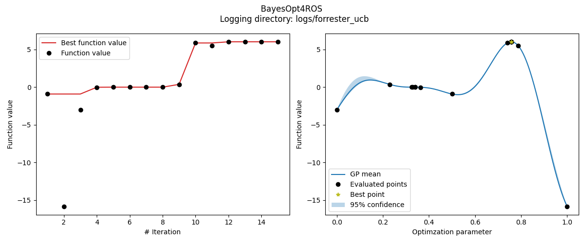

Getting started
===============

Here you find two ways of getting started with the BayesOpt4ROS package.
If you already have a catkin workspace and would like to directly integrate BayesOpt4ROS into your workflow, please see :ref:`this tutorial<Your own workspace>`.
In case you just want to try out the package, follow :ref:`this example<Example workspace (Docker)>` to set up a workspace inside a Docker container.

Your own workspace
------------------

For the following steps, we'll assume that :code:`${WORKSPACE}` is the root of your catkin workspace.

Requirements
^^^^^^^^^^^^

BayesOpt4ROS requires Python 3, which is the default version when you use ROS Noetic (or newer).
If you are using ROS Melodic (or older) you first need to set up Python 3 for your workspace.

Installation
^^^^^^^^^^^^

First, let's clone BayesOpt4ROS as a package into your workspace:

.. code-block:: bash
   
    cd ${WORKSPACE}
    git clone https://github.com/lukasfro/bayesopt4ros.git src/bayesopt4ros

Our package is written in Python and requires some 3rd parties libraries to work.
You can easily install them via `pip <https://pip.pypa.io/en/stable/>`_:

.. code-block:: bash

    python3 -m pip install -r src/bayesopt4ros/requirements.txt

Now we should be ready to build the workspace:

.. code-block:: bash

    # Either this
    catkin_make
    source devel/setup.bash 
    # Or this
    catkin_make_isolated
    source devel_isolated/setup.bash

You should be good to go now.
One way of quickly testing if the installation worked is by launching the server.

.. code-block:: bash

    roslaunch bayesopt4ros bayesopt_server.launch

You should see the output of the server similar to this:

.. code-block:: bash

    [INFO] [1616593243.400756]: [BayesOpt] Iteration 0: Ready to receive requests.

.. note:: If roslaunch fails, make sure that the node script is executable.

    .. code-block:: bash

        chmod +x src/bayesopt4ros/nodes/bayesopt_server.py

The server node is now ready to receive requests from a client (your node).
Continue with the tutorial to see what callback methods you need to implement.

Client implementation
^^^^^^^^^^^^^^^^^^^^^

The BayesOpt4ROS package uses the ActionServer/ActionClient communication pattern.
On the `official ROS homepage <http://wiki.ros.org/actionlib_tutorials/Tutorials>`_ you can find tutorials for an exemplary implementation.
Since BayesOpt4ROS already provides the server side, you just need to implement the client code.
In the following, we show you what methods/callbacks you have to implement to communicate with the server (depending on the language of your choice).

C++
"""

Until we have a more detailed description, you can also have a look at the `C++ test client <https://github.com/lukasfro/bayesopt4ros/blob/main/test/integration/test_client_cpp.cpp>`_.

.. todo:: Explicitly show what methods have to be implemented.

Python
""""""

Until we have a more detailed description, you can also have a look at the `python test client <https://github.com/lukasfro/bayesopt4ros/blob/main/test/integration/test_client_python.py>`_

.. todo:: Explicitly show what methods have to be implemented.

Example workspace (Docker)
--------------------------

In case you do not directly want to install BayesOpt4ROS into your own workspace, we provide `a repository <https://github.com/lukasfro/bayesopt4ros_workspace>`_ to test the package within a Docker container.
If you do not have `Docker <https://www.docker.com/get-started>`_ installed, now would be a good time to do so.

Set up Docker
^^^^^^^^^^^^^

First, clone the workspace repository:

.. code-block:: bash
    
    git clone https://github.com/lukasfro/bayesopt4ros_workspace.git
    cd bayesopt4ros_workspace

Next, let's create an image from the provided Dockerfile and run a container

.. code-block:: bash

    # -t tags a docker image with a name, 'bayesopt4ros' in our case
    docker build -t bayesopt4ros .

    # -it runs the container in interactive mode
    # -v mounts our current directory to the workspace in the container
    docker run -it -v $(pwd):/root/ws/ bayesopt4ros

.. note:: If you are working on a MacBook M1 with ARM chip, you need to adapt the Dockerfile to pull the right ROS image.
    Just have a look `here <https://github.com/lukasfro/bayesopt4ros_workspace/blob/main/Dockerfile>`_ and change the base image:

    .. code-block:: bash

        # For all machines except MacBooks with M1 CPU
        FROM osrf/ros:noetic-desktop-full

        # Use this image when your are using a MacBook with M1 CPU
        FROM arm64v8/ros:noetic

Running test client
^^^^^^^^^^^^^^^^^^^

The following commands will only work within the Docker container.
Let's build the workspace:

.. code-block:: bash

    catkin_make_isolated
    source devel_isolated/setup.bash

The easiest way to see the server in action is by executing one of the integration tests:

.. code-block:: bash
    
    rostest bayesopt4ros test_client_python.test

If you want to look at the results, we provide a small visualization script.
You can run the following command outside of the running Docker container if you want to directly show the results.
We also save an image to disk to the logging directory (this also works within the Docker container since we mounted your local workspace to the container workspace).

.. code-block:: bash
    
    python3 visualize.py --log-dir logs/forrester_ucb

The resulting image should look something like this

